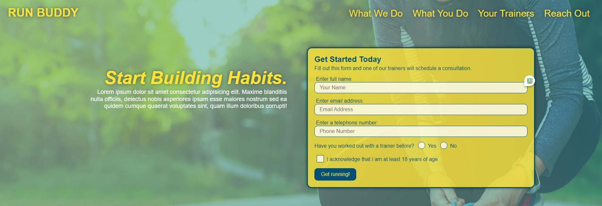

**Project Title:**

Run Buddy Website

---

**Project Description/Summary:**

Designing a website for Run Buddy Inc. - a company that offers fitness training services. Leveraged CSS and HTMl to create an interactive site that allows users to sign up for training sessions.

---

**Live Site:**

Head over to https://cwarmbrunn.github.io/run-buddy/
to view the page live!

---

**Technology Used:**

- HTML
- CSS

---

**Installation:**

You can clone this repo - no special instructions to load this!

---

**Screenshots:**

